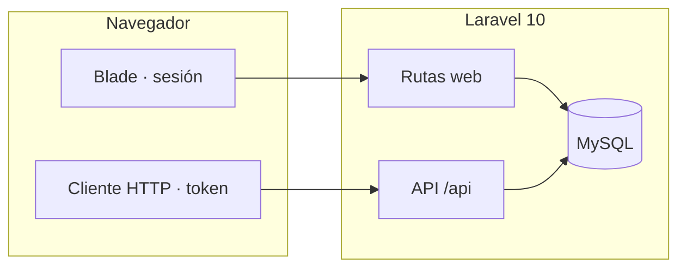

<div align="center">

# EDA_SOCIAL

**Plataforma de video social** — Laravel 10 · PHP 8.2+ => Blade · API REST


<br>

[Resumen](#resumen) · [Arquitectura](#stack-y-arquitectura) · [**Dependencias**](#dependencias-y-librerias) · [Instalación](#instalacion-en-desarrollo) · [API](#api-rest) · [Despliegue](#despliegue-en-produccion) · [PHP / Composer](#php-y-composer) · [Panel admin](#panel-admin-avanzado)

</div>

---

## Resumen

EDA_SOCIAL es una aplicación para **publicar y descubrir** contenido en vídeo e **imágenes**, con **feed** filtrable, **fichas de publicación**, **comentarios en hilos**, **votos**, **estadísticas de vistas**, **moderación** y **panel de administración**. La interfaz principal se sirve con **Laravel y Blade** (sesión web); un **cliente HTTP** (SPA, app móvil, scripts) puede usar la misma lógica vía **API JSON** bajo el prefijo `/api`.

> **Nota de alcance:** el código de aplicación vive en el directorio `backend/`. Cualquier frontend separado (por ejemplo React) puede convivir en otro repositorio o carpeta apuntando a esta API.

---

## Tabla de contenidos

1. [Resumen](#resumen)
2. [Capacidades principales](#capacidades-principales)
3. [Stack y arquitectura](#stack-y-arquitectura)
4. [Mapa del repositorio](#mapa-del-repositorio)
5. [Dependencias y librerías](#dependencias-y-librerias)
6. [Requisitos del entorno (resumen)](#requisitos-del-entorno-resumen)
7. [Instalación en desarrollo](#instalacion-en-desarrollo)
8. [Compilación de assets (Laravel Mix)](#compilacion-de-assets-laravel-mix)
9. [Experiencia web destacada](#experiencia-web-destacada)
10. [Arquitectura de vistas web (Blade)](#arquitectura-de-vistas-web-blade)
11. [Rutas HTTP (Blade)](#rutas-http-blade)
12. [API REST](#api-rest)
13. [Autenticación API](#autenticacion-api)
14. [Comentarios en hilos](#comentarios-en-hilos)
15. [Branding y logo por defecto](#branding-y-logo-por-defecto)
16. [Roles y administración](#roles-y-administracion)
17. [Carga masiva e importación](#carga-masiva-e-importacion)
18. [FFmpeg, HLS y postprocesado de vídeo](#ffmpeg-hls-y-postprocesado-de-video)
19. [Colas, RabbitMQ y Redis](#colas-rabbitmq-y-redis)
20. [PHP y Composer (varias versiones)](#php-y-composer)
21. [Portadas JPEG, Open Graph y rendimiento del feed](#portadas-open-graph-y-feed)
22. [Panel de administración avanzado](#panel-admin-avanzado)
23. [Comandos Artisan y programador (cron)](#comandos-artisan-y-cron)
24. [Variables de entorno](#variables-de-entorno)
25. [Despliegue en producción](#despliegue-en-produccion)
26. [Seguridad y buenas prácticas](#seguridad-y-buenas-practicas)
27. [Referencias y mantenimiento](#referencias-y-mantenimiento)

---

## Capacidades principales

| Ámbito | Detalle |
|--------|---------|
| **Exploración** | Listado paginado con filtros por categoría y hashtag; búsqueda en título y descripción (controlador `ExploreController`). |
| **Publicación** | Subida de uno o varios archivos (imagen/vídeo), título, descripción, hashtags y categorías; creación vía `VideoPublisher` y job opcional de postprocesado. |
| **Interacción** | Comentarios anidados (respuestas), votos en comentarios, vistas registradas por publicación. |
| **Identidad** | Usuario con canal; ajustes de plataforma (nombre del sitio, color de menú, logo, SEO, anuncios, integraciones). |
| **Moderación** | Roles `admin` y `moderator`; bloqueo de vídeos, baneo de usuarios, importación Reddit (API y panel). |
| **Descubrimiento** | Sitemap en `/sitemap.xml`; vídeos relacionados en la ficha. |

---

## Stack y arquitectura

| Capa | Tecnología | Ubicación típica |
|------|------------|------------------|
| **Aplicación** | PHP 8.2+, Laravel 10 | `backend/app/`, `backend/routes/` |
| **Vistas** | Blade, CSS propio | `backend/resources/views/web/`, `backend/public/css/eda-social.css` |
| **Datos** | MySQL, Eloquent | `backend/database/migrations/` |
| **API** | JSON, token en `users.api_token` | Prefijo `/api` (`RouteServiceProvider`) |
| **Asíncrono** | Colas Laravel (`media`): `ProcessVideoMediaJob`, `GenerateVideoHlsJob`, `GenerateVideoPosterJob` | `backend/app/Jobs/` |



---

## Mapa del repositorio

```
EDA_SOCIAL/
├── README.md                 ← Documentación del producto (este archivo)
└── backend/
    ├── app/                  Modelos, controladores Web/API, middleware, jobs, servicios
    ├── bootstrap/
    ├── config/               media.php (FFmpeg), hls.php, database.php, queue.php, cors.php, videosegg.php
    ├── database/migrations/
    ├── database/seeds/
    ├── public/               Punto de entrada HTTP: index.php, css/, imágenes estáticas, enlace a storage
    ├── resources/views/web/  Plantillas Blade
    ├── resources/js|sass/  Entradas opcionales de Laravel Mix
    ├── routes/web.php · routes/api.php
    ├── storage/
    ├── artisan
    ├── art                 ← Wrapper opcional: ejecuta artisan con PHP 8.4+ (Homebrew)
    ├── composer.json
    ├── package.json
    └── webpack.mix.js
```

Un resumen operativo del paquete Laravel está en [`backend/README.md`](backend/README.md).

---

<a id="dependencias-y-librerias"></a>

## Dependencias y librerías

Todo el flujo del proyecto gira en **`backend/`**. Instalá primero lo del **sistema**, después **`composer install`**, y por último lo **opcional** (npm, Redis, RabbitMQ, FFmpeg) según lo que vayas a usar.

| Paso | Comando / acción |
|------|------------------|
| 1 | PHP + extensiones (tabla de abajo) |
| 2 | `cd backend && composer install` |
| 3 | `cp .env.example .env` y `php artisan key:generate` |
| 4 | MySQL creado + `php artisan migrate` |
| 5 | *(Opcional)* `npm install` si compilás assets con Mix |
| 6 | *(Opcional)* Redis / RabbitMQ / FFmpeg + variables en `.env` |

> **Producción:** tras cambiar `.env`, ejecutá `php artisan config:cache`. Laravel **no** vuelve a leer el `.env` en cada request cuando la config está cacheada; los valores quedan en el blob generado. Más detalle en [Variables de entorno](#variables-de-entorno).

### Sistema operativo y binarios

| | Componente | Notas |
|---|------------|--------|
| 🐘 | **PHP** | `^8.2` en `composer.json`; el lock puede exigir **≥ 8.4** por dependencias transitivas. Recomendado **8.4 u 8.5** en local y producción. |
| 🧩 | **Extensiones PHP** | `pdo_mysql`, `mbstring`, `openssl`, `tokenizer`, `xml`, `ctype`, `json`, `fileinfo`, `curl`, `zip` (habituales en Laravel). |
| ⚡ | **Ext. Redis (opcional)** | Paquete PECL **`redis`** si querés `REDIS_CLIENT=phpredis`. Si no está instalada, el proyecto usa **`predis/predis`** por defecto (sin extensión C). |
| 📦 | **Composer 2.x** | Gestión de dependencias PHP y autoload PSR-4. |
| 🗄️ | **MySQL 8** o **MariaDB** | Base principal; conexión opcional `videosegg` para datos legados. |
| 🌐 | **Servidor web** | Nginx o Apache + **PHP-FPM**; document root = `backend/public`. |
| 📗 | **Cliente `mysql` en PATH** | Opcional: comandos tipo importación SQL (`videosegg:load-sql`). |

### Paquetes PHP (`composer.json`)

Ejecutá **`composer install`** en `backend/` (o `composer install --no-dev` en producción). Principales dependencias de aplicación:

| Paquete | Rol en el proyecto |
|---------|-------------------|
| `laravel/framework` ^10 | Framework web, colas, Eloquent, Blade, scheduler. |
| `guzzlehttp/guzzle` ^7 | Cliente HTTP (APIs externas, Reddit, etc.). |
| `laravel/tinker` | Consola REPL (`php artisan tinker`). |
| `predis/predis` ^2 | Cliente Redis en PHP puro; colas/caché sin extensión `redis`. |
| `vladimir-yuldashev/laravel-queue-rabbitmq` ^13 | Driver **`rabbitmq`** para colas Laravel + **php-amqplib** (transitivo). |

**Solo desarrollo / CI** (`require-dev`): `fakerphp/faker`, `laravel/pint`, `laravel/sail`, `mockery/mockery`, `nunomaduro/collision`, `phpunit/phpunit`, `spatie/laravel-ignition`.

### Paquetes Node (`package.json`)

Solo necesarios si recompilás estilos o JS con **Laravel Mix** (`npm run dev` / `production`). **Node 18+** y **npm** recomendados.

| Paquete | Rol |
|---------|-----|
| `laravel-mix` ^6 | Orquestación Webpack 5 para assets Laravel. |
| `webpack` 5.94.x | Bundler (fijado vía `overrides` en `package.json`). |
| `tailwindcss` ^3 | Utilidades CSS (si usás las entradas Mix que lo referencian). |
| `postcss`, `autoprefixer` | Pipeline CSS. |
| `@tailwindcss/forms` | Plugin de formularios para Tailwind. |
| `axios` | Cliente HTTP en bundles JS (plantillas típicas Laravel). |

### Servicios y software multimedia (opcionales)

| | Servicio | Para qué sirve |
|---|----------|----------------|
| 🔴 | **Redis** | Caché y/o colas si activás integración en panel y `REDIS_*` en `.env`. |
| 🐰 | **RabbitMQ** + plugin **management** | Cola `QUEUE_CONNECTION=rabbitmq`; panel admin muestra métricas vía HTTP API (puerto típico **15672**). |
| 🎬 | **FFmpeg** + **FFprobe** | Compresión de vídeo, posters JPEG, previews y transcodificación **HLS** (`config/media.php`, `config/hls.php`). |
| 🐳 | **Docker** | Opcional vía **Laravel Sail** (`laravel/sail`) para entorno aislado. |

---

<a id="requisitos-del-entorno-resumen"></a>

## Requisitos del entorno (resumen)

| Componente | Notas |
|------------|--------|
| **PHP** | **^8.2**; lock puede exigir **≥ 8.4**. Producción: PHP 8.4 u 8.5. |
| **Extensiones** | `pdo_mysql`, `mbstring`, `openssl`, `tokenizer`, `xml`, `ctype`, `json`, `fileinfo`, `curl`, `zip`; **`redis`** (PECL) solo si usás `phpredis`. |
| **Composer** | `composer install` en `backend/`. |
| **MySQL** | Base principal; base opcional `videosegg`. |
| **Node + npm** | Solo si compilás assets con Laravel Mix. |
| **Producción** | Nginx o Apache + PHP-FPM; `root` → `backend/public`. |
| **Opcional** | Redis, RabbitMQ (+ management), FFmpeg, cliente `mysql` en PATH. |

---

<a id="instalacion-en-desarrollo"></a>

## Instalación en desarrollo

```bash
cd backend
composer install          # Usá el mismo PHP que cumple composer.json (p. ej. php8.5 $(which composer) install)
cp .env.example .env
php artisan key:generate
```

En máquinas con **varias versiones de PHP** (p. ej. macOS con PHP 7.2 en el PATH), podés usar el script **`./art`** en `backend/`, que intenta **PHP 8.5 / 8.4** de Homebrew antes de llamar a `artisan`.

Configurar al menos `APP_*`, `DB_*` y, si aplica, colas, Redis, FFmpeg y variables `VIDEOSEGG_*` (véase la sección de variables de entorno).

```bash
php artisan migrate
php artisan db:seed          # Solo en entornos controlados; revisar seeders antes
php artisan storage:link     # Si ya existe el enlace: php artisan storage:link --force
php artisan serve --host=127.0.0.1 --port=8000   # Si el 8000 está ocupado: --port=8001
```

- **Aplicación web y API:** `http://127.0.0.1:8000`  
- **Rutas API:** `http://127.0.0.1:8000/api/...`

---

## Compilación de assets (Laravel Mix)

Desde `backend/`:

```bash
npm install
npm run dev          # Build de desarrollo
npm run watch        # Desarrollo con observación de archivos
npm run production   # Build minificado
```

Por defecto, `webpack.mix.js` compila `resources/js/app.js` → `public/js/app.js` y `resources/sass/app.scss` → `public/css/app.css`. La interfaz Blade depende sobre todo de **`public/css/eda-social.css`**; si no se usan los bundles Mix en las vistas, **npm run production** puede ser opcional en el flujo de despliegue.

---

## Experiencia web destacada

### Publicar en modal

El flujo de **Publicar** no usa una página dedicada: el formulario vive en un **modal** dentro del layout (`web/partials/publish-modal.blade.php`). El enlace del menú abre el modal con JavaScript; la ruta `GET /publicar` redirige a `/explorar` con sesión para abrir el modal (compatibilidad sin JS y enlaces directos). Tras errores de validación en `POST /publicar`, la respuesta conserva `open_publish_modal` para reabrir el modal con mensajes y `old()`.

Las categorías del formulario se inyectan con un **`View::composer`** sobre `web.layout` (`AppServiceProvider`) para usuarios autenticados.

### Vista previa local de archivos

Antes de enviar el formulario, al seleccionar imágenes o vídeos se muestran **miniaturas locales** (`URL.createObjectURL` en el script del layout): imágenes en ``, vídeos en `<video controls muted playsinline>`. Las URLs de objeto se revocan al cambiar la selección para liberar memoria.

---

## Arquitectura de vistas web (Blade)

Vistas principales y parciales más relevantes del flujo web:

| Vista | Rol en el sistema |
|-------|-------------------|
| `resources/views/web/layout.blade.php` | Layout principal: topbar, menú, modal de publicar, scripts globales, branding (logo/color). |
| `resources/views/web/explore.blade.php` | Feed de publicaciones, búsqueda y filtros por categorías/hashtags. |
| `resources/views/web/post.blade.php` | Página single del vídeo: reproductor, ads top/bottom, rating, relacionados, comentarios, reporte. |
| `resources/views/web/admin/panel.blade.php` | Panel por secciones: `seo`, `aspecto`, `banners`, **`integraciones`** (colas en vivo, enlace RabbitMQ management), **`monitoreo`** (CPU/RAM/disco/procesos), `verificacion`, `usuarios`, `videos`, `reportes`, `reddit`, `metricas` (solo admin), etc. |
| `resources/views/web/admin/banners.blade.php` | Configuración visual de zonas de anuncios (top/bottom/popup), plantillas y scripts por slot. |
| `resources/views/web/partials/video-rating.blade.php` | Componente de valoración por bolitas (1–5), estado visual y envío AJAX. |
| `resources/views/web/partials/comment-thread.blade.php` | Render recursivo de comentarios y respuestas. |

Notas operativas de UI:

- El logo en barra superior se resuelve desde `branding.logo_url`; si no existe, cae a `public/images/default-logo.svg`.
- En **Aspecto** se recomienda logo horizontal **250×50 px** para cabecera.
- El panel de **Videos** permite editar metadatos, subir miniatura por archivo, bloquear/activar y disparar procesos de media (previews/HLS).

---

## Rutas HTTP (Blade)

| Método y ruta | Nombre Laravel | Descripción |
|---------------|----------------|-------------|
| `GET /` | — | Redirección a `/explorar` |
| `GET /explorar` | `explore.index` | Feed paginado |
| `GET /p/{video}` | `posts.show` | Ficha, comentarios, votos |
| `POST /p/{video}/comentarios` | `posts.comments.store` | Nuevo comentario o respuesta (`parent_id` opcional) |
| `POST /comentarios/{comment}/votar` | `posts.comments.vote` | Voto +1 / −1 |
| `GET /login` · `POST /login` | `login` | Acceso (invitados) |
| `POST /logout` | `logout` | Cierre de sesión |
| `GET /publicar` | `publish.create` | Redirección a explorar + abrir modal |
| `POST /publicar` | `publish.store` | Crear publicación (multipart) |
| `GET /cuenta` | `account.show` | Cuenta de usuario |
| `GET /admin/{section}` | `admin.panel` | Panel: `seo`, `aspecto`, `banners`, `integraciones`, `verificacion`, `monitoreo`, `usuarios`, `videos`, `reportes`, `reddit`, `metricas` |
| `GET /admin/colas/estado` | `admin.queue_status` | JSON para la tabla “Colas en tiempo real” (throttle) |
| `GET /admin/sitemap/status` | `admin.sitemap_status` | Progreso de generación de sitemap (SEO) |
| `POST /admin/...` | varias | Acciones del panel |
| `GET /sitemap.xml` | — | Sitemap |
| `GET /robots.txt` | — | `robots.txt` dinámico |

---

## API REST

Base URL: **`/api`**. Respuestas en JSON. El grupo `api` aplica throttle (por ejemplo 60 peticiones por minuto).

### Endpoints públicos

| Método | Ruta | Descripción breve |
|--------|------|-------------------|
| `POST` | `/api/auth/register` | Alta de usuario; devuelve `token` y `user` |
| `POST` | `/api/auth/login` | Autenticación; devuelve `token` y `user` |
| `GET` | `/api/platform-settings` | Ajustes públicos de la plataforma |
| `GET` | `/api/categories` | Listado de categorías |
| `GET` | `/api/videos` | Listado paginado (`search`, `category_id`, `hashtag`, `per_page`) |
| `GET` | `/api/videos/{video}` | Detalle con vídeo, comentarios en árbol, relacionados, anuncios y estadísticas |
| `GET` | `/api/videos/{video}/comments` | Árbol de comentarios (misma forma anidada que en el detalle) |

### Endpoints autenticados (`auth:api`)

| Método | Ruta | Descripción breve |
|--------|------|-------------------|
| `GET` | `/api/auth/me` | Usuario actual con relaciones habituales |
| `POST` | `/api/videos` | Crear publicación (JSON: `video_url` o `media_items`, categorías, hashtags, etc.) |
| `POST` | `/api/uploads/media` | Subida multipart; validación máx. **51200** KB por archivo |
| `POST` | `/api/videos/{video}/comments` | Cuerpo: `body`, opcional `parent_id` |
| `POST` | `/api/comments/{comment}/vote` | Cuerpo: `value` ∈ `{-1, 1}` |

### Prefijo administración (`/api/admin/*`)

Requiere token y rol **`admin`** o **`moderator`**. Incluye ajustes de plataforma (SEO, logo, color, integraciones, anuncios de vídeo, verificación, sitemap), importación Reddit, categorías, dashboard, usuarios, búsqueda y bloqueos.

---

## Autenticación API

El guard **`api`** usa el driver **`token`**: el valor enviado se compara con la columna **`users.api_token`** (`hash` desactivado en `config/auth.php`). El token se genera al crear el usuario y se devuelve en registro e inicio de sesión.

Orden de lectura del token (comportamiento estándar de `TokenGuard`):

1. Parámetro de consulta `api_token`
2. Campo `api_token` en el cuerpo de la petición
3. Cabecera `Authorization: Bearer …`
4. Autenticación HTTP básica (poco habitual en este proyecto)

---

## Comentarios en hilos

- Esquema: columna **`parent_id`** en `comments` (FK opcional a otro comentario).
- **Web:** campo oculto `parent_id` y acción «Responder» en cada comentario.
- **API:** `parent_id` opcional en creación; validación centralizada en **`Comment::replyParentError`** (mismo vídeo, límite de profundidad de respuestas).
- **JSON:** comentarios raíz con relación **`replies`** anidada de forma recursiva en memoria (`Comment::nestForDisplay`).

---

## Branding y logo por defecto

Si no hay `logo_url` guardado en ajustes de plataforma, se usa un recurso por defecto **`public/images/default-logo.svg`** (wordmark **EDA-SOCIAL**, proporción acorde al contenedor de cabecera **230×50** px definido en CSS). La resolución se centraliza en **`PlatformConfig::resolvedLogoUrl()`** para Blade y para `GET /api/platform-settings`.

---

## Roles y administración

| Rol | Uso típico |
|-----|------------|
| `user` | Publicar, comentar, cuenta personal. |
| `moderator` | Panel web `/admin/...` y rutas `/api/admin/...` con permisos de moderación. |
| `admin` | Igual que moderador con alcance administrativo completo según implementación. |

Los roles base se crean con **`RoleSeeder`**. El panel web usa el middleware **`admin_or_mod_web`**; la API admin usa **`admin_or_mod`**.

En **Colas → Integraciones** se pueden activar flags en `platform_settings` (**Redis** para caché, **RabbitMQ** como intención de uso). La conexión real de Laravel sigue viniendo de **`QUEUE_CONNECTION`** y `config/queue.php`; RabbitMQ como broker requiere paquete y variables `RABBITMQ_*` correctas.

---

## Carga masiva e importación

### Importación desde legado **videosegg** (alto volumen)

1. Crear base MySQL para el dump (`videosegg` u otro nombre en `VIDEOSEGG_DATABASE`).
2. Colocar el dump en **`~/Documents/videosegg/`** (por ejemplo `dbvideosegg_2026_04_30_fixed.sql` si aplicaste el parche del DDL faltante, o el `.sql` original).
3. Cargar el SQL (`mysql` o `php artisan videosegg:load-sql`; la config busca por defecto en `Documents/videosegg/`).
4. Disponer en disco las carpetas de **vídeos**, **imágenes** y **previa** (por defecto también bajo `~/Documents/videosegg/` o `~/Downloads/` según `.env`).
5. Configurar variables `VIDEOSEGG_*` en `.env` si no usas las rutas por defecto.
6. Ejecutar `php artisan videosegg:import-posts` con las rutas adecuadas.

Opciones destacadas del comando de importación: `--videos-path`, `--imagenes-path`, `--previa-path`, `--user-id`, `--limit`, `--dry-run`. El procesamiento usa **`chunkById(150)`** sobre la tabla `posts` para limitar el uso de memoria.

Tras copiar medios a `storage/app/public`, ejecutar **`php artisan storage:link`** si aún no existe el enlace simbólico bajo `public/`.

La importación por Artisan **no** encola automáticamente `ProcessVideoMediaJob` por cada fila; la compresión masiva posterior requeriría un proceso o comando ad hoc.

### Carpeta local de vídeos (sin base videosegg)

Para importar **solo archivos** desde una carpeta (por ejemplo `~/Downloads/videos`), sin tabla `posts` del legado:

```bash
cd backend
php artisan videos:import-from-folder "/ruta/absoluta/a/videos" --dry-run --limit=5
php artisan videos:import-from-folder "/ruta/absoluta/a/videos" --limit=50 --user-id=1
```

- Sin argumento `path`, se usa la variable de entorno **`VIDEO_IMPORT_FOLDER`** o, por defecto, `~/Downloads/videos` (véase `.env.example`).
- **`--dry-run`:** lista qué haría sin copiar ni insertar.
- **`--limit=N`:** máximo de ficheros (recomendable en carpetas muy grandes).
- **`--user-id=`:** autor; debe existir **canal** asociado (si se omite, se usa el primer usuario con canal).
- Los ficheros se copian a `storage/app/public/{--prefix=}/` (por defecto `local-imports/`) y se crea cada publicación con **`VideoPublisher`** (descripción breve fija y job de multimedia si la cola lo permite).

### Otras vías

- **Reddit:** `POST /api/reddit/import` (admin/mod), una publicación por petición; encola el job de multimedia para el vídeo creado.
- **Subida HTTP:** API `POST /api/uploads/media` o formulario web; para lotes muy grandes suele ser preferible copiar archivos al servidor y usar la importación masiva o scripts propios.

Alinear **límites de PHP** (`upload_max_filesize`, `post_max_size`), **Nginx** (`client_max_body_size`) y **timeouts** con el tamaño máximo deseado (coherente con la validación de **50 MB** por archivo en la API web de publicación).

---

<a id="ffmpeg-hls-y-postprocesado-de-video"></a>

## FFmpeg, HLS y postprocesado de vídeo

La configuración está en **`config/media.php`**, alimentada por variables de entorno. El servicio **`LocalVideoCompressor`** invoca **libx264** (CRF, preset, ancho máximo, AAC o reintento sin audio) solo para rutas que resuelvan a ficheros bajo el disco **`public`** (`/storage/...`). El job **`ProcessVideoMediaJob`** recorre `video_url`, `preview_url` y elementos `VideoMedia` de tipo vídeo.

| Variable | Valor por defecto típico | Rol |
|----------|-------------------------|-----|
| `FFMPEG_ENABLED` | `false` | Activa o desactiva la compresión. |
| `FFMPEG_BINARY` | `ffmpeg` | Ejecutable. |
| `FFMPEG_CRF` | `28` | Calidad H.264 (valores más bajos = más calidad y más peso). |
| `FFMPEG_PRESET` | `medium` | Equilibrio velocidad / compresión. |
| `FFMPEG_MAX_WIDTH` | `1280` | Escalado con filtro `scale`. |
| `FFMPEG_AUDIO_BITRATE` | `128k` | Bitrate AAC cuando hay audio. |
| `FFMPEG_TIMEOUT` | `900` | Segundos por proceso. |
| `FFMPEG_MIN_BYTES` | `200000` | Umbral mínimo de tamaño para intentar comprimir. |
| `FFMPEG_MAX_BYTES` | `524288000` | Tope superior (500 MiB por defecto en config). |
| `FFPROBE_BINARY` | `ffprobe` | Definido en config para uso futuro / coherencia. |

El job solo sustituye el fichero si el resultado es **sustancialmente más pequeño** que el original.

### Portadas JPEG (poster) y miniaturas “reales”

- **`VideoPreviewGenerationService::generatePosterIfMissing()`** genera `storage/app/public/generated-previews/{id}_poster.jpg` y actualiza `videos.thumbnail_url`.
- **`Video::needsPosterImageGeneration()`**: hace falta poster si no hay miniatura **o** si `thumbnail_url` apunta a un **archivo de vídeo** (p. ej. `.mp4`), para corregir datos incorrectos al publicar.
- **Encolado:** `GenerateVideoPosterJob` en cola **`media`** al publicar (`VideoPublisher`), al listar el feed (videos sin poster), al abrir la ficha del vídeo (`PostController`) y tras **`ProcessVideoMediaJob`** (cuando el fichero ya está en disco). Los `dispatch()` usan **`afterResponse()`** para no alargar la respuesta HTTP cuando `QUEUE_CONNECTION=sync`.
- **Feed `/explorar`:** no ejecuta ffmpeg en el request; solo encola jobs y usa vista previa por **fragmento HLS** opcional (`HlsPreviewService` + `card_preview_url` en tarjetas).
- **Comando batch:** `php artisan videos:generate-posters` (solo JPG; ver [Comandos Artisan y cron](#comandos-artisan-y-cron)).
- **Open Graph:** en la ficha del post, `og:image` / Twitter Card usan `Video::openGraphImageAbsolute()` (miniatura JPG o primera imagen en `media`); si no hay imagen, cae al logo del sitio (`web/layout.blade.php`).

### HLS on-demand (m3u8 + ts)

El proyecto soporta transcodificación HLS en background con `GenerateVideoHlsJob` y `HlsTranscodingService`:

- Se dispara al entrar al vídeo (si detecta fuente MP4/MOV/WEBM local) y también desde botón manual en Admin → Videos.
- Genera playlist y segmentos en:
  - `storage/app/public/hls/{video_id}/{hash}/index.m3u8`
  - `storage/app/public/hls/{video_id}/{hash}/segment_XXX.ts`
- Si el reproductor detecta `.m3u8`, `post.blade.php` inicializa `hls.js` y Plyr reproduce HLS.
- Opcionalmente, puede borrar el MP4 origen tras conversión (`HLS_DELETE_SOURCE_MP4=true`) cuando no colisiona con `preview_url`.

### Requisitos de ejecución media

- `ffmpeg` instalado y accesible en PATH (o ruta explícita en `.env`).
- Worker activo para cola `media`:
  - `php artisan queue:work --queue=media,default`

---

## Colas RabbitMQ y Redis

| Driver | Cuándo usarlo |
|--------|----------------|
| **`sync`** | Desarrollo; ejecuta el job en la misma petición (riesgo de timeout con vídeos pesados). |
| **`database`** | Producción sencilla con tabla `jobs` y `php artisan queue:work --queue=media,default`. |
| **`redis`** | Colas y caché si Redis está instalado y configurado. |
| **`rabbitmq`** | Requiere paquete Composer (p. ej. `vladimir-yuldashev/laravel-queue-rabbitmq`) y conexión `rabbitmq` en `config/queue.php`. `QUEUE_CONNECTION=rabbitmq` en `.env`. |

Variables habituales AMQP en `.env`: `RABBITMQ_HOST`, `RABBITMQ_PORT`, `RABBITMQ_USER`, `RABBITMQ_PASSWORD`, `RABBITMQ_VHOST`.

### Ejemplo real Producer / Consumer (portadas ffmpeg)

El flujo de “magia” en backend para portadas usa patrón **Producer → Broker (RabbitMQ) → Consumer (worker Laravel)**.

**Producer (admin):** encola un job por video en la cola `media`.

```php
// App\Http\Controllers\Web\AdminPanelController@enqueueMissingPostersBatch
foreach ($videoIds as $videoId) {
    GenerateVideoPosterProgressJob::dispatch(
        $videoId,
        $batchId,
        $scope === 'all',
        $durationAware
    );
}
```

El job define explícitamente la cola:

```php
// App\Jobs\GenerateVideoPosterProgressJob
public function __construct(int $videoId, string $batchId, bool $forceReplace, bool $durationAware)
{
    $this->videoId = $videoId;
    $this->batchId = $batchId;
    $this->forceReplace = $forceReplace;
    $this->durationAware = $durationAware;
    $this->onQueue('media');
}
```

**Consumer (worker):** el proceso `queue:work` toma mensajes de RabbitMQ y ejecuta `handle()`.

```php
// App\Jobs\GenerateVideoPosterProgressJob@handle
public function handle(VideoPreviewGenerationService $previewService): void
{
    $video = Video::query()->find($this->videoId);
    if (!$video) {
        $this->mark('fail', 'Video no encontrado.');
        return;
    }

    $r = $previewService->generatePosterJpeg($video, null, $this->forceReplace, $this->durationAware);
    $status = $r['status'] === 'ok' ? 'ok' : ($r['status'] === 'skip' ? 'ok' : 'fail');
    $this->mark($status, (string) ($r['detail'] ?? ''));
}
```

Comando del consumer en servidor:

```bash
php artisan queue:work rabbitmq --queue=media,default --tries=3 --timeout=1200
```

Con esto, el request HTTP del admin no ejecuta ffmpeg directamente: solo publica mensajes, y el worker procesa en segundo plano.

### Panel admin: colas en vivo y enlace al plugin web

- Ruta JSON **`GET /admin/colas/estado`** (`admin.queue_status`): usada por la sección **Colas** del panel para refrescar cada pocos segundos.
- Implementación: **`App\Services\QueueMonitorService`**
  - Con **`QUEUE_CONNECTION=rabbitmq`**: consulta la **HTTP API de RabbitMQ Management** (`GET /api/queues/{vhost}`) usando credenciales de gestión.
  - Con **`QUEUE_CONNECTION=database`**: agrega por nombre de cola los jobs **en espera** (`reserved_at` nulo) y **en proceso** (`reserved_at` no nulo) desde la tabla `jobs`.
  - Siempre incluye el conteo de **`failed_jobs`** (si la tabla existe).
- En **Administración → Colas** aparece un botón **“Panel web RabbitMQ (management)”** si está definido `RABBITMQ_MANAGEMENT_URL` o, en su defecto, `http://{RABBITMQ_HOST}:{RABBITMQ_MANAGEMENT_PORT}` (puerto por defecto **15672**). Requiere plugin **`rabbitmq_management`** en el broker.
- Variables opcionales de gestión / filtro de nombres de cola en el monitor: `RABBITMQ_MANAGEMENT_URL`, `RABBITMQ_MANAGEMENT_USER`, `RABBITMQ_MANAGEMENT_PASSWORD`, `RABBITMQ_MANAGEMENT_PORT`, **`RABBITMQ_ADMIN_QUEUE_NAMES`** (lista separada por comas, por defecto `media,default`).
- En el mismo apartado del panel hay un bloque desplegable **“RabbitMQ — instalación y usuario…”** con comandos de ejemplo (`rabbitmqctl`, vhost, usuario, permisos, Docker).

Para **Redis** como caché: activar el flag en panel **Integraciones**, definir `REDIS_*` y disponer de la extensión PHP **redis**.

---

<a id="php-y-composer"></a>

## PHP y Composer (varias versiones)

- El proyecto declara **PHP ^8.2**; en la práctica el **lock** puede requerir **PHP ≥ 8.4** por dependencias transitivas.
- **Composer** y **`php artisan`** deben ejecutarse con una versión de PHP compatible; si el `php` del sistema es antiguo (p. ej. 7.2), usá la ruta completa del binario correcto o el script **`backend/art`**.
- **PHP 8.5 / PDO:** en `config/database.php` se usa `\Pdo\Mysql::ATTR_SSL_CA` a partir de PHP 8.5 para evitar deprecations con `MYSQL_ATTR_SSL_CA`.

---

<a id="portadas-open-graph-y-feed"></a>

## Portadas JPEG, Open Graph y rendimiento del feed

- **Tarjetas del feed** (`web/partials/explore-video-cards.blade.php`): si `thumbnail_url` es un vídeo, se ignora para la imagen y se intenta la primera imagen en `media`; vista previa hover puede usar **HLS** sin cargar el MP4 completo (`HlsPreviewService`).
- **SEO al compartir:** metadatos `og:*` y `twitter:*` en `web/layout.blade.php`; en la ficha del vídeo se pasan `seoOgImage`, `seoOgDescription` y `og:type` = `article` desde `PostController`.
- **Rendimiento:** la generación pesada de portadas **no** bloquea la respuesta de `/explorar`; se delega a colas y/o comandos Artisan.

---

<a id="panel-admin-avanzado"></a>

## Panel de administración avanzado

| Sección | Contenido relevante |
|---------|---------------------|
| **SEO** | Sitemap con opción de incluir todas las publicaciones, barra de progreso vía `admin/sitemap/status`, `robots.txt` dinámico, metadatos globales. |
| **Colas** (`integraciones`) | JSON de estado de integración, flags Redis/RabbitMQ, **tabla de colas en tiempo real**, enlace al **Management UI** de RabbitMQ, documentación plegable de instalación y usuarios. |
| **Monitoreo** | RAM, CPU, disco y top procesos (snapshot en servidor Linux; requiere `ps` / `/proc` donde aplique). |
| **Aspecto / Banners / Videos** | Logo, color, anuncios (incl. VAST), edición y jobs HLS/previews desde admin. |

---

<a id="comandos-artisan-y-cron"></a>

## Comandos Artisan y programador (cron)

| Comando | Descripción |
|---------|-------------|
| `php artisan videos:generate-posters --limit=40` | Solo **portadas JPEG** para vídeos que las necesitan (ffmpeg). |
| `php artisan videos:generate-previews --limit=30` | Poster **+** clip MP4 de hover donde falte. |

En **`app/Console/Kernel.php`** está programado (si usás el scheduler de Laravel) un paso horario que ejecuta **`videos:generate-posters`** con un límite acotado. Añadí en el cron del servidor:

`* * * * * cd /ruta/al/backend && php artisan schedule:run >> /dev/null 2>&1`

---

## Variables de entorno

El archivo **`backend/.env.example`** documenta el esqueleto. Grupos frecuentes:

| Grupo | Ejemplos |
|-------|----------|
| Aplicación | `APP_NAME`, `APP_ENV`, `APP_KEY`, `APP_DEBUG`, `APP_URL` |
| Base principal | `DB_CONNECTION`, `DB_HOST`, `DB_PORT`, `DB_DATABASE`, `DB_USERNAME`, `DB_PASSWORD` |
| videosegg (legado) | `VIDEOSEGG_SQL_PATH` (dump en `~/Documents/videosegg/`), `VIDEOSEGG_DATABASE`, `VIDEOSEGG_DB_*`, rutas de medios |
| Colas / Redis | `QUEUE_CONNECTION`, `REDIS_HOST`, `REDIS_PASSWORD`, `REDIS_PORT` |
| FFmpeg | Prefijo `FFMPEG_*` (compresión/poster/previews) |
| HLS | `HLS_ENABLED`, `HLS_FFMPEG_BINARY`, `HLS_SEGMENT_TIME`, `HLS_CRF`, `HLS_PRESET`, `HLS_DELETE_SOURCE_MP4` |
| RabbitMQ (AMQP) | `RABBITMQ_HOST`, `RABBITMQ_PORT`, `RABBITMQ_USER`, `RABBITMQ_PASSWORD`, `RABBITMQ_VHOST` |
| RabbitMQ (panel / monitor) | `RABBITMQ_MANAGEMENT_URL`, `RABBITMQ_MANAGEMENT_PORT`, `RABBITMQ_MANAGEMENT_USER`, `RABBITMQ_MANAGEMENT_PASSWORD`, `RABBITMQ_ADMIN_QUEUE_NAMES` |
| Correo | `MAIL_*` |

---

<a id="despliegue-en-produccion"></a>

## Despliegue en producción

Secuencia orientativa sobre **Linux**, **Nginx**, **PHP-FPM** y **MySQL** (ajustar rutas y versiones).

1. **Servidor:** PHP-FPM con extensiones necesarias, Nginx o Apache, MySQL o MariaDB; opcionalmente Node (solo si se compila Mix en el servidor), FFmpeg, Redis, RabbitMQ.
2. **Código:** clonar el repositorio y situarse en `backend/`.
3. **Dependencias:** `composer install --no-dev --optimize-autoloader`.
4. **Entorno:** copiar `.env`, fijar `APP_ENV=production`, `APP_DEBUG=false`, `APP_URL` con HTTPS, credenciales `DB_*`, colas y servicios opcionales.
5. **Clave y migraciones:** `php artisan key:generate` si hace falta; `php artisan migrate --force`.
6. **Storage:** `php artisan storage:link`.
7. **Optimización:** `php artisan config:cache` y, si las rutas lo permiten, `php artisan route:cache` y `view:cache`.
8. **Permisos:** el usuario del pool FPM debe escribir en `storage/` y `bootstrap/cache/`.
9. **Nginx:** `root` apuntando a **`.../backend/public`**; `client_max_body_size` acorde a las subidas.
10. **HTTPS:** certificado gestionado (p. ej. Let’s Encrypt) o corporativo.
11. **Workers:** `php artisan queue:work --queue=media,default` bajo **Supervisor** o **systemd** si la cola no es `sync` (con RabbitMQ, usar el driver y conexión configurados en `config/queue.php`).
12. **Cron:** `* * * * * cd /ruta/al/backend && php artisan schedule:run` — el `Kernel` programa tareas como **`videos:generate-posters`** (portadas) cuando corresponda.
13. **CORS y proxies:** revisar `config/cors.php` y `TrustProxies` si hay CDN o balanceador.

Tras el despliegue: probar autenticación, una publicación, subida de medios y, si aplica, un job en cola; revisar `storage/logs/laravel.log`.

---

## Seguridad y buenas prácticas

- Mantener `APP_DEBUG=false` en producción y proteger el fichero `.env`.
- Rotar credenciales por defecto de cualquier **seeder** antes de exponer el sistema.
- Copias de seguridad periódicas de la base de datos y de `storage/app/public`.
- Cumplimiento legal y de términos de terceros al importar contenido (Reddit, legados, etc.).
- Limitar y auditar el acceso al panel de administración y a las rutas `/api/admin/*`.

---

## Referencias y mantenimiento

- Framework: [documentación Laravel 10.x](https://laravel.com/docs/10.x).
- Pruebas automatizadas: desde `backend/`, `./vendor/bin/phpunit` si existen suites en `tests/`.
- **Mantenimiento:** mantener `composer.lock` al día en despliegues; revisar jobs fallidos (`failed_jobs`) y el monitor de colas en el panel admin.

El núcleo del framework Laravel se distribuye bajo licencia **MIT**. El resto del repositorio puede complementarse con la política de licencias que defina el propietario del proyecto.

---

<p align="center"><sub>Documentación generada para el repositorio EDA_SOCIAL · Backend en <code>backend/</code></sub></p>
