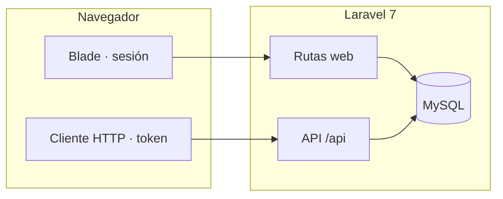

<h1 align="center">EDA_SOCIAL</h1>

<p align="center"><strong>Plataforma de video social</strong> · Laravel 7 · Blade · API REST</p>

<p align="center">
  <a href="#resumen">Resumen</a> ·
  <a href="#stack-y-arquitectura">Arquitectura</a> ·
  <a href="#instalacion-en-desarrollo">Instalación</a> ·
  <a href="#api-rest">API</a> ·
  <a href="#despliegue-en-produccion">Despliegue</a>
</p>

---

## Resumen

EDA_SOCIAL es una aplicación para **publicar y descubrir** contenido en vídeo e **imágenes**, con **feed** filtrable, **fichas de publicación**, **comentarios en hilos**, **votos**, **estadísticas de vistas**, **moderación** y **panel de administración**. La interfaz principal se sirve con **Laravel y Blade** (sesión web); un **cliente HTTP** (SPA, app móvil, scripts) puede usar la misma lógica vía **API JSON** bajo el prefijo `/api`.

> **Nota de alcance:** el código de aplicación vive en el directorio `backend/`. Cualquier frontend separado (por ejemplo React) puede convivir en otro repositorio o carpeta apuntando a esta API.

---

## Tabla de contenidos

1. [Resumen](#resumen)
2. [Capacidades principales](#capacidades-principales)
3. [Stack y arquitectura](#stack-y-arquitectura)
4. [Mapa del repositorio](#mapa-del-repositorio)
5. [Requisitos del entorno](#requisitos-del-entorno)
6. [Instalación en desarrollo](#instalacion-en-desarrollo)
7. [Compilación de assets (Laravel Mix)](#compilacion-de-assets-laravel-mix)
8. [Experiencia web destacada](#experiencia-web-destacada)
9. [Arquitectura de vistas web (Blade)](#arquitectura-de-vistas-web-blade)
10. [Rutas HTTP (Blade)](#rutas-http-blade)
11. [API REST](#api-rest)
12. [Autenticación API](#autenticacion-api)
13. [Comentarios en hilos](#comentarios-en-hilos)
14. [Branding y logo por defecto](#branding-y-logo-por-defecto)
15. [Roles y administración](#roles-y-administracion)
16. [Carga masiva e importación](#carga-masiva-e-importacion)
17. [FFmpeg, HLS y postprocesado de vídeo](#ffmpeg-hls-y-postprocesado-de-video)
18. [Colas, RabbitMQ y Redis](#colas-rabbitmq-y-redis)
19. [Variables de entorno](#variables-de-entorno)
20. [Despliegue en producción](#despliegue-en-produccion)
21. [Seguridad y buenas prácticas](#seguridad-y-buenas-practicas)
22. [Referencias y mantenimiento](#referencias-y-mantenimiento)

---

## Capacidades principales

| Ámbito | Detalle |
|--------|---------|
| **Exploración** | Listado paginado con filtros por categoría y hashtag; búsqueda en título y descripción (controlador `ExploreController`). |
| **Publicación** | Subida de uno o varios archivos (imagen/vídeo), título, descripción, hashtags y categorías; creación vía `VideoPublisher` y job opcional de postprocesado. |
| **Interacción** | Comentarios anidados (respuestas), votos en comentarios, vistas registradas por publicación. |
| **Identidad** | Usuario con canal; ajustes de plataforma (nombre del sitio, color de menú, logo, SEO, anuncios, integraciones). |
| **Moderación** | Roles `admin` y `moderator`; bloqueo de vídeos, baneo de usuarios, importación Reddit (API y panel). |
| **Descubrimiento** | Sitemap en `/sitemap.xml`; vídeos relacionados en la ficha. |

---

## Stack y arquitectura

| Capa | Tecnología | Ubicación típica |
|------|------------|------------------|
| **Aplicación** | PHP, Laravel 7 | `backend/app/`, `backend/routes/` |
| **Vistas** | Blade, CSS propio | `backend/resources/views/web/`, `backend/public/css/eda-social.css` |
| **Datos** | MySQL, Eloquent | `backend/database/migrations/` |
| **API** | JSON, token en `users.api_token` | Prefijo `/api` (`RouteServiceProvider`) |
| **Asíncrono** | Colas Laravel (`media`): `ProcessVideoMediaJob`, `GenerateVideoHlsJob`, `GenerateVideoPosterJob` | `backend/app/Jobs/` |



---

## Mapa del repositorio

```
EDA_SOCIAL/
├── README.md                 ← Documentación del producto (este archivo)
└── backend/
    ├── app/                  Modelos, controladores Web/API, middleware, jobs, servicios
    ├── bootstrap/
    ├── config/               media.php (FFmpeg), hls.php, database.php, queue.php, cors.php, videosegg.php
    ├── database/migrations/
    ├── database/seeds/
    ├── public/               Punto de entrada HTTP: index.php, css/, imágenes estáticas, enlace a storage
    ├── resources/views/web/  Plantillas Blade
    ├── resources/js|sass/  Entradas opcionales de Laravel Mix
    ├── routes/web.php · routes/api.php
    ├── storage/
    ├── artisan
    ├── composer.json
    ├── package.json
    └── webpack.mix.js
```

Un resumen operativo del paquete Laravel está en [`backend/README.md`](backend/README.md).

---

## Requisitos del entorno

| Componente | Notas |
|------------|--------|
| **PHP** | ≥ 7.2.5 según `composer.json`; en servidores nuevos se recomienda PHP 8.x con pruebas de compatibilidad. |
| **Extensiones** | Entre otras: `pdo_mysql`, `mbstring`, `openssl`, `tokenizer`, `xml`, `ctype`, `json`, `fileinfo`. |
| **Composer** | Instalación y autoload de dependencias. |
| **MySQL** | Base principal; base adicional opcional `videosegg` para migración desde legado. |
| **Node + npm** | Solo si se compilan assets con Laravel Mix. |
| **Producción** | Nginx o Apache + PHP-FPM; document root = `backend/public`. |
| **Opcional** | Cliente `mysql` en PATH (`videosegg:load-sql`), Redis, FFmpeg, RabbitMQ (+ paquete Laravel para el driver). |

---

<a id="instalacion-en-desarrollo"></a>

## Instalación en desarrollo

```bash
cd backend
composer install
cp .env.example .env
php artisan key:generate
```

Configurar al menos `APP_*`, `DB_*` y, si aplica, colas, Redis, FFmpeg y variables `VIDEOSEGG_*` (véase la sección de variables de entorno).

```bash
php artisan migrate
php artisan db:seed          # Solo en entornos controlados; revisar seeders antes
php artisan storage:link
php artisan serve --host=127.0.0.1 --port=8000
```

- **Aplicación web y API:** `http://127.0.0.1:8000`  
- **Rutas API:** `http://127.0.0.1:8000/api/...`

---

## Compilación de assets (Laravel Mix)

Desde `backend/`:

```bash
npm install
npm run dev          # Build de desarrollo
npm run watch        # Desarrollo con observación de archivos
npm run production   # Build minificado
```

Por defecto, `webpack.mix.js` compila `resources/js/app.js` → `public/js/app.js` y `resources/sass/app.scss` → `public/css/app.css`. La interfaz Blade depende sobre todo de **`public/css/eda-social.css`**; si no se usan los bundles Mix en las vistas, **npm run production** puede ser opcional en el flujo de despliegue.

---

## Experiencia web destacada

### Publicar en modal

El flujo de **Publicar** no usa una página dedicada: el formulario vive en un **modal** dentro del layout (`web/partials/publish-modal.blade.php`). El enlace del menú abre el modal con JavaScript; la ruta `GET /publicar` redirige a `/explorar` con sesión para abrir el modal (compatibilidad sin JS y enlaces directos). Tras errores de validación en `POST /publicar`, la respuesta conserva `open_publish_modal` para reabrir el modal con mensajes y `old()`.

Las categorías del formulario se inyectan con un **`View::composer`** sobre `web.layout` (`AppServiceProvider`) para usuarios autenticados.

### Vista previa local de archivos

Antes de enviar el formulario, al seleccionar imágenes o vídeos se muestran **miniaturas locales** (`URL.createObjectURL` en el script del layout): imágenes en ``, vídeos en `<video controls muted playsinline>`. Las URLs de objeto se revocan al cambiar la selección para liberar memoria.

---

## Arquitectura de vistas web (Blade)

Vistas principales y parciales más relevantes del flujo web:

| Vista | Rol en el sistema |
|-------|-------------------|
| `resources/views/web/layout.blade.php` | Layout principal: topbar, menú, modal de publicar, scripts globales, branding (logo/color). |
| `resources/views/web/explore.blade.php` | Feed de publicaciones, búsqueda y filtros por categorías/hashtags. |
| `resources/views/web/post.blade.php` | Página single del vídeo: reproductor, ads top/bottom, rating, relacionados, comentarios, reporte. |
| `resources/views/web/admin/panel.blade.php` | Panel administrativo por secciones (`seo`, `aspecto`, `banners`, `integraciones`, `usuarios`, `videos`, `metricas`, etc.). |
| `resources/views/web/admin/banners.blade.php` | Configuración visual de zonas de anuncios (top/bottom/popup), plantillas y scripts por slot. |
| `resources/views/web/partials/video-rating.blade.php` | Componente de valoración por bolitas (1–5), estado visual y envío AJAX. |
| `resources/views/web/partials/comment-thread.blade.php` | Render recursivo de comentarios y respuestas. |

Notas operativas de UI:

- El logo en barra superior se resuelve desde `branding.logo_url`; si no existe, cae a `public/images/default-logo.svg`.
- En **Aspecto** se recomienda logo horizontal **250×50 px** para cabecera.
- El panel de **Videos** permite editar metadatos, subir miniatura por archivo, bloquear/activar y disparar procesos de media (previews/HLS).

---

## Rutas HTTP (Blade)

| Método y ruta | Nombre Laravel | Descripción |
|---------------|----------------|-------------|
| `GET /` | — | Redirección a `/explorar` |
| `GET /explorar` | `explore.index` | Feed paginado |
| `GET /p/{video}` | `posts.show` | Ficha, comentarios, votos |
| `POST /p/{video}/comentarios` | `posts.comments.store` | Nuevo comentario o respuesta (`parent_id` opcional) |
| `POST /comentarios/{comment}/votar` | `posts.comments.vote` | Voto +1 / −1 |
| `GET /login` · `POST /login` | `login` | Acceso (invitados) |
| `POST /logout` | `logout` | Cierre de sesión |
| `GET /publicar` | `publish.create` | Redirección a explorar + abrir modal |
| `POST /publicar` | `publish.store` | Crear publicación (multipart) |
| `GET /cuenta` | `account.show` | Cuenta de usuario |
| `GET /admin/{section}` | `admin.panel` | Panel: `seo`, `aspecto`, `integraciones`, `verificacion`, `usuarios`, `reddit` |
| `POST /admin/...` | varias | Acciones del panel |
| `GET /sitemap.xml` | — | Sitemap |

---

## API REST

Base URL: **`/api`**. Respuestas en JSON. El grupo `api` aplica throttle (por ejemplo 60 peticiones por minuto).

### Endpoints públicos

| Método | Ruta | Descripción breve |
|--------|------|-------------------|
| `POST` | `/api/auth/register` | Alta de usuario; devuelve `token` y `user` |
| `POST` | `/api/auth/login` | Autenticación; devuelve `token` y `user` |
| `GET` | `/api/platform-settings` | Ajustes públicos de la plataforma |
| `GET` | `/api/categories` | Listado de categorías |
| `GET` | `/api/videos` | Listado paginado (`search`, `category_id`, `hashtag`, `per_page`) |
| `GET` | `/api/videos/{video}` | Detalle con vídeo, comentarios en árbol, relacionados, anuncios y estadísticas |
| `GET` | `/api/videos/{video}/comments` | Árbol de comentarios (misma forma anidada que en el detalle) |

### Endpoints autenticados (`auth:api`)

| Método | Ruta | Descripción breve |
|--------|------|-------------------|
| `GET` | `/api/auth/me` | Usuario actual con relaciones habituales |
| `POST` | `/api/videos` | Crear publicación (JSON: `video_url` o `media_items`, categorías, hashtags, etc.) |
| `POST` | `/api/uploads/media` | Subida multipart; validación máx. **51200** KB por archivo |
| `POST` | `/api/videos/{video}/comments` | Cuerpo: `body`, opcional `parent_id` |
| `POST` | `/api/comments/{comment}/vote` | Cuerpo: `value` ∈ `{-1, 1}` |

### Prefijo administración (`/api/admin/*`)

Requiere token y rol **`admin`** o **`moderator`**. Incluye ajustes de plataforma (SEO, logo, color, integraciones, anuncios de vídeo, verificación, sitemap), importación Reddit, categorías, dashboard, usuarios, búsqueda y bloqueos.

---

## Autenticación API

El guard **`api`** usa el driver **`token`**: el valor enviado se compara con la columna **`users.api_token`** (`hash` desactivado en `config/auth.php`). El token se genera al crear el usuario y se devuelve en registro e inicio de sesión.

Orden de lectura del token (comportamiento estándar de `TokenGuard`):

1. Parámetro de consulta `api_token`
2. Campo `api_token` en el cuerpo de la petición
3. Cabecera `Authorization: Bearer …`
4. Autenticación HTTP básica (poco habitual en este proyecto)

---

## Comentarios en hilos

- Esquema: columna **`parent_id`** en `comments` (FK opcional a otro comentario).
- **Web:** campo oculto `parent_id` y acción «Responder» en cada comentario.
- **API:** `parent_id` opcional en creación; validación centralizada en **`Comment::replyParentError`** (mismo vídeo, límite de profundidad de respuestas).
- **JSON:** comentarios raíz con relación **`replies`** anidada de forma recursiva en memoria (`Comment::nestForDisplay`).

---

## Branding y logo por defecto

Si no hay `logo_url` guardado en ajustes de plataforma, se usa un recurso por defecto **`public/images/default-logo.svg`** (wordmark **EDA-SOCIAL**, proporción acorde al contenedor de cabecera **230×50** px definido en CSS). La resolución se centraliza en **`PlatformConfig::resolvedLogoUrl()`** para Blade y para `GET /api/platform-settings`.

---

## Roles y administración

| Rol | Uso típico |
|-----|------------|
| `user` | Publicar, comentar, cuenta personal. |
| `moderator` | Panel web `/admin/...` y rutas `/api/admin/...` con permisos de moderación. |
| `admin` | Igual que moderador con alcance administrativo completo según implementación. |

Los roles base se crean con **`RoleSeeder`**. El panel web usa el middleware **`admin_or_mod_web`**; la API admin usa **`admin_or_mod`**.

En **Aspecto → Integraciones** se pueden activar flags almacenados en `platform_settings` (**Redis** para caché, **RabbitMQ** para colas); `AppServiceProvider` aplica la configuración en tiempo de arranque si el entorno cumple los requisitos (extensión Redis, host, paquete RabbitMQ instalado, etc.).

---

## Carga masiva e importación

### Importación desde legado **videosegg** (alto volumen)

1. Crear base MySQL para el dump (`videosegg` u otro nombre en `VIDEOSEGG_DATABASE`).
2. Colocar el dump en **`~/Documents/videosegg/`** (por ejemplo `dbvideosegg_2026_04_30_fixed.sql` si aplicaste el parche del DDL faltante, o el `.sql` original).
3. Cargar el SQL (`mysql` o `php artisan videosegg:load-sql`; la config busca por defecto en `Documents/videosegg/`).
4. Disponer en disco las carpetas de **vídeos**, **imágenes** y **previa** (por defecto también bajo `~/Documents/videosegg/` o `~/Downloads/` según `.env`).
5. Configurar variables `VIDEOSEGG_*` en `.env` si no usas las rutas por defecto.
6. Ejecutar `php artisan videosegg:import-posts` con las rutas adecuadas.

Opciones destacadas del comando de importación: `--videos-path`, `--imagenes-path`, `--previa-path`, `--user-id`, `--limit`, `--dry-run`. El procesamiento usa **`chunkById(150)`** sobre la tabla `posts` para limitar el uso de memoria.

Tras copiar medios a `storage/app/public`, ejecutar **`php artisan storage:link`** si aún no existe el enlace simbólico bajo `public/`.

La importación por Artisan **no** encola automáticamente `ProcessVideoMediaJob` por cada fila; la compresión masiva posterior requeriría un proceso o comando ad hoc.

### Carpeta local de vídeos (sin base videosegg)

Para importar **solo archivos** desde una carpeta (por ejemplo `~/Downloads/videos`), sin tabla `posts` del legado:

```bash
cd backend
php artisan videos:import-from-folder "/ruta/absoluta/a/videos" --dry-run --limit=5
php artisan videos:import-from-folder "/ruta/absoluta/a/videos" --limit=50 --user-id=1
```

- Sin argumento `path`, se usa la variable de entorno **`VIDEO_IMPORT_FOLDER`** o, por defecto, `~/Downloads/videos` (véase `.env.example`).
- **`--dry-run`:** lista qué haría sin copiar ni insertar.
- **`--limit=N`:** máximo de ficheros (recomendable en carpetas muy grandes).
- **`--user-id=`:** autor; debe existir **canal** asociado (si se omite, se usa el primer usuario con canal).
- Los ficheros se copian a `storage/app/public/{--prefix=}/` (por defecto `local-imports/`) y se crea cada publicación con **`VideoPublisher`** (descripción breve fija y job de multimedia si la cola lo permite).

### Otras vías

- **Reddit:** `POST /api/reddit/import` (admin/mod), una publicación por petición; encola el job de multimedia para el vídeo creado.
- **Subida HTTP:** API `POST /api/uploads/media` o formulario web; para lotes muy grandes suele ser preferible copiar archivos al servidor y usar la importación masiva o scripts propios.

Alinear **límites de PHP** (`upload_max_filesize`, `post_max_size`), **Nginx** (`client_max_body_size`) y **timeouts** con el tamaño máximo deseado (coherente con la validación de **50 MB** por archivo en la API web de publicación).

---

<a id="ffmpeg-hls-y-postprocesado-de-video"></a>

## FFmpeg, HLS y postprocesado de vídeo

La configuración está en **`config/media.php`**, alimentada por variables de entorno. El servicio **`LocalVideoCompressor`** invoca **libx264** (CRF, preset, ancho máximo, AAC o reintento sin audio) solo para rutas que resuelvan a ficheros bajo el disco **`public`** (`/storage/...`). El job **`ProcessVideoMediaJob`** recorre `video_url`, `preview_url` y elementos `VideoMedia` de tipo vídeo.

| Variable | Valor por defecto típico | Rol |
|----------|-------------------------|-----|
| `FFMPEG_ENABLED` | `false` | Activa o desactiva la compresión. |
| `FFMPEG_BINARY` | `ffmpeg` | Ejecutable. |
| `FFMPEG_CRF` | `28` | Calidad H.264 (valores más bajos = más calidad y más peso). |
| `FFMPEG_PRESET` | `medium` | Equilibrio velocidad / compresión. |
| `FFMPEG_MAX_WIDTH` | `1280` | Escalado con filtro `scale`. |
| `FFMPEG_AUDIO_BITRATE` | `128k` | Bitrate AAC cuando hay audio. |
| `FFMPEG_TIMEOUT` | `900` | Segundos por proceso. |
| `FFMPEG_MIN_BYTES` | `200000` | Umbral mínimo de tamaño para intentar comprimir. |
| `FFMPEG_MAX_BYTES` | `524288000` | Tope superior (500 MiB por defecto en config). |
| `FFPROBE_BINARY` | `ffprobe` | Definido en config para uso futuro / coherencia. |

El job solo sustituye el fichero si el resultado es **sustancialmente más pequeño** que el original.

### Generación automática de poster (primer acceso)

Cuando un vídeo se abre en la página single y no tiene `thumbnail_url`, el controlador web encola `GenerateVideoPosterJob` (cola `media`). El job usa `VideoPreviewGenerationService::generatePosterIfMissing()` para crear:

- `storage/app/public/generated-previews/{video_id}_poster.jpg`

Y guarda la URL final en `videos.thumbnail_url`.

### HLS on-demand (m3u8 + ts)

El proyecto soporta transcodificación HLS en background con `GenerateVideoHlsJob` y `HlsTranscodingService`:

- Se dispara al entrar al vídeo (si detecta fuente MP4/MOV/WEBM local) y también desde botón manual en Admin → Videos.
- Genera playlist y segmentos en:
  - `storage/app/public/hls/{video_id}/{hash}/index.m3u8`
  - `storage/app/public/hls/{video_id}/{hash}/segment_XXX.ts`
- Si el reproductor detecta `.m3u8`, `post.blade.php` inicializa `hls.js` y Plyr reproduce HLS.
- Opcionalmente, puede borrar el MP4 origen tras conversión (`HLS_DELETE_SOURCE_MP4=true`) cuando no colisiona con `preview_url`.

### Requisitos de ejecución media

- `ffmpeg` instalado y accesible en PATH (o ruta explícita en `.env`).
- Worker activo para cola `media`:
  - `php artisan queue:work --queue=media,default`

---

## Colas RabbitMQ y Redis

| Driver | Cuándo usarlo |
|--------|----------------|
| **`sync`** | Desarrollo; ejecuta el job en la misma petición (riesgo de timeout con vídeos pesados). |
| **`database`** | Producción sencilla con tabla `jobs` y `php artisan queue:work --queue=media,default`. |
| **`redis`** | Colas y caché si Redis está instalado y configurado. |
| **`rabbitmq`** | Requiere paquete adicional (p. ej. `vladimir-yuldashev/laravel-queue-rabbitmq`) y entrada en `config/queue.php`. El proyecto puede forzar `queue.default = rabbitmq` si el flag de plataforma, `RABBITMQ_HOST` y la clase del conector están presentes (`AppServiceProvider`). |

Variables habituales de RabbitMQ en `.env`: `RABBITMQ_HOST`, `RABBITMQ_PORT`, `RABBITMQ_USER`, `RABBITMQ_PASSWORD`, `RABBITMQ_VHOST`.

Para **Redis** como caché: activar el flag en panel, definir `REDIS_*` y disponer de la extensión PHP **redis**.

---

## Variables de entorno

El archivo **`backend/.env.example`** documenta el esqueleto. Grupos frecuentes:

| Grupo | Ejemplos |
|-------|----------|
| Aplicación | `APP_NAME`, `APP_ENV`, `APP_KEY`, `APP_DEBUG`, `APP_URL` |
| Base principal | `DB_CONNECTION`, `DB_HOST`, `DB_PORT`, `DB_DATABASE`, `DB_USERNAME`, `DB_PASSWORD` |
| videosegg (legado) | `VIDEOSEGG_SQL_PATH` (dump en `~/Documents/videosegg/`), `VIDEOSEGG_DATABASE`, `VIDEOSEGG_DB_*`, rutas de medios |
| Colas / Redis | `QUEUE_CONNECTION`, `REDIS_HOST`, `REDIS_PASSWORD`, `REDIS_PORT` |
| FFmpeg | Prefijo `FFMPEG_*` (compresión/poster/previews) |
| HLS | `HLS_ENABLED`, `HLS_FFMPEG_BINARY`, `HLS_SEGMENT_TIME`, `HLS_CRF`, `HLS_PRESET`, `HLS_DELETE_SOURCE_MP4` |
| RabbitMQ | Prefijo `RABBITMQ_*` |
| Correo | `MAIL_*` |

---

<a id="despliegue-en-produccion"></a>

## Despliegue en producción

Secuencia orientativa sobre **Linux**, **Nginx**, **PHP-FPM** y **MySQL** (ajustar rutas y versiones).

1. **Servidor:** PHP-FPM con extensiones necesarias, Nginx o Apache, MySQL o MariaDB; opcionalmente Node (solo si se compila Mix en el servidor), FFmpeg, Redis, RabbitMQ.
2. **Código:** clonar el repositorio y situarse en `backend/`.
3. **Dependencias:** `composer install --no-dev --optimize-autoloader`.
4. **Entorno:** copiar `.env`, fijar `APP_ENV=production`, `APP_DEBUG=false`, `APP_URL` con HTTPS, credenciales `DB_*`, colas y servicios opcionales.
5. **Clave y migraciones:** `php artisan key:generate` si hace falta; `php artisan migrate --force`.
6. **Storage:** `php artisan storage:link`.
7. **Optimización:** `php artisan config:cache` y, si las rutas lo permiten, `php artisan route:cache` y `view:cache`.
8. **Permisos:** el usuario del pool FPM debe escribir en `storage/` y `bootstrap/cache/`.
9. **Nginx:** `root` apuntando a **`.../backend/public`**; `client_max_body_size` acorde a las subidas.
10. **HTTPS:** certificado gestionado (p. ej. Let’s Encrypt) o corporativo.
11. **Workers:** `php artisan queue:work --queue=media,default` bajo **Supervisor** o **systemd** si la cola no es `sync`.
12. **Cron:** si en el futuro se define el programador en `app/Console/Kernel.php`, añadir la entrada estándar `* * * * * php artisan schedule:run`.
13. **CORS y proxies:** revisar `config/cors.php` y `TrustProxies` si hay CDN o balanceador.

Tras el despliegue: probar autenticación, una publicación, subida de medios y, si aplica, un job en cola; revisar `storage/logs/laravel.log`.

---

## Seguridad y buenas prácticas

- Mantener `APP_DEBUG=false` en producción y proteger el fichero `.env`.
- Rotar credenciales por defecto de cualquier **seeder** antes de exponer el sistema.
- Copias de seguridad periódicas de la base de datos y de `storage/app/public`.
- Cumplimiento legal y de términos de terceros al importar contenido (Reddit, legados, etc.).
- Limitar y auditar el acceso al panel de administración y a las rutas `/api/admin/*`.

---

## Referencias y mantenimiento ---

- Framework: [documentación Laravel 7.x](https://laravel.com/docs/7.x).
- Pruebas automatizadas: desde `backend/`, `./vendor/bin/phpunit` si existen suites en `tests/`.
- **Evolución recomendada:** planificar migración a PHP 8.x y una versión mayor de Laravel con batería de pruebas y revisión de dependencias.

El núcleo del framework Laravel se distribuye bajo licencia **MIT**. El resto del repositorio puede complementarse con la política de licencias que defina el propietario del proyecto.

---

<p align="center"><sub>Documentación generada para el repositorio EDA_SOCIAL · Backend en <code>backend/</code></sub></p>
